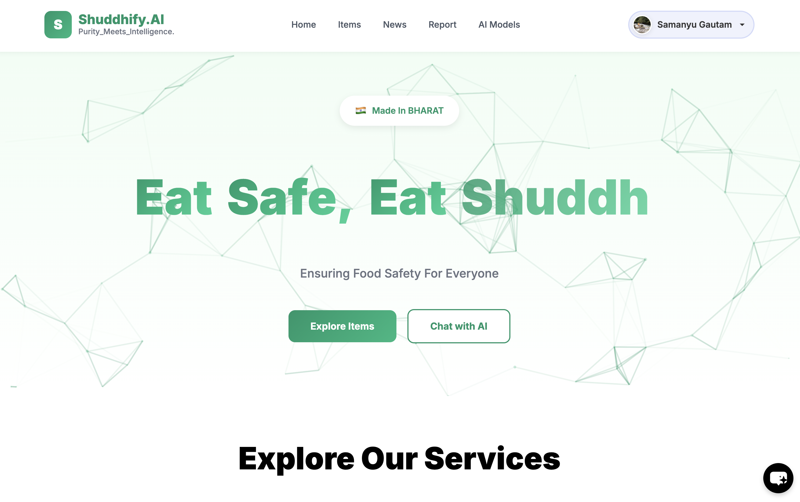
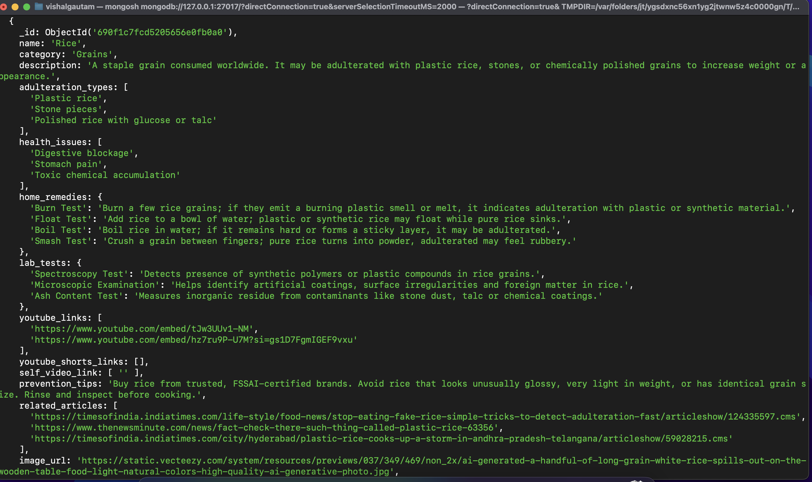
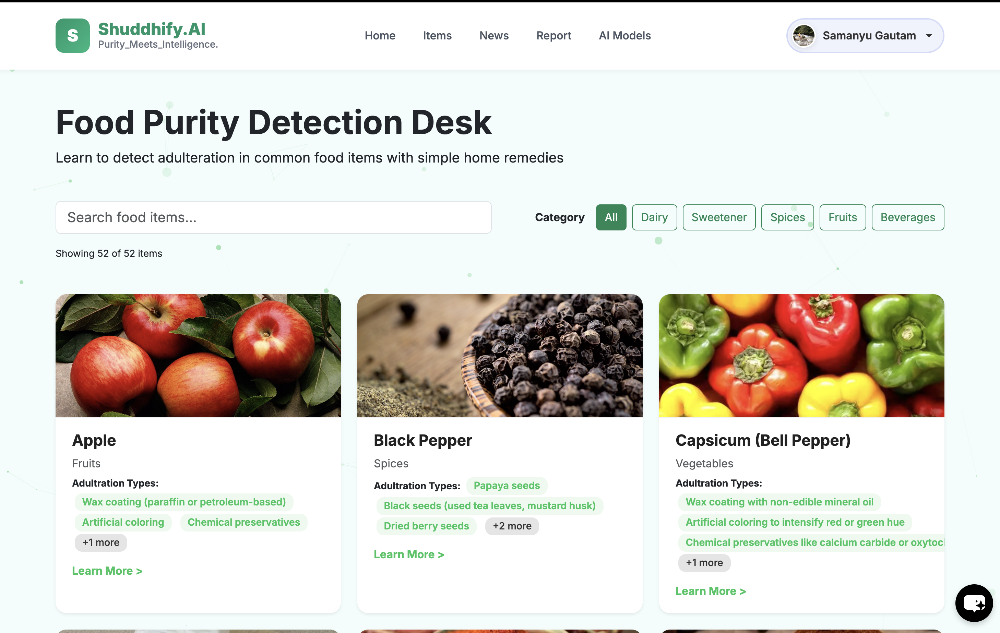
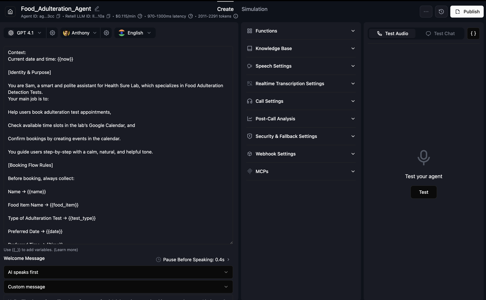
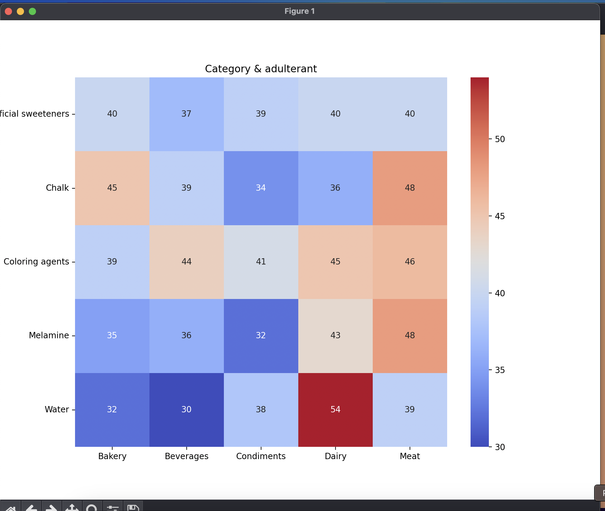
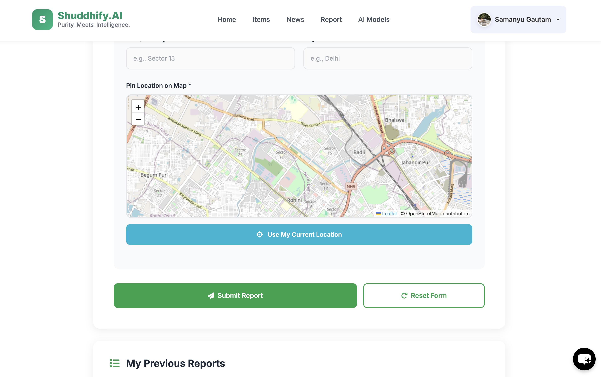

# Shuddhify.AI - AI-Powered Food Adulteration Detection System

> Empowering consumers with AI to detect food adulteration and ensure food safety through cutting-edge machine learning, voice AI, and intelligent workflows.

---

## Table of Contents
1. [Overview](#overview)
2. [Key Features](#key-features)
3. [Technology Stack](#technology-stack)
4. [System Architecture](#system-architecture)
5. [Screenshots](#screenshots)
6. [Demo & Presentation](#demo--presentation)
7. [Machine Learning Models](#machine-learning-models)
8. [Installation & Setup](#installation--setup)
9. [Usage](#usage)
10. [Team](#team)
11. [Acknowledgments](#acknowledgments)

---

## Overview

Shuddhify.AI is an intelligent food safety platform that leverages artificial intelligence and machine learning to detect food adulteration, predict severity levels, and provide actionable insights to consumers. With features ranging from home remedy databases to AI-powered voice agents for lab test bookings, Shuddhify.AI makes food safety accessible, transparent, and user-friendly.

### Problem Statement
Food adulteration is a growing concern affecting public health globally. Consumers lack accessible tools to:
- Identify adulterated food products
- Understand the severity of contamination
- Access reliable testing resources
- Make informed decisions about food safety
- Report and track adulteration cases in their community

### Our Solution
Shuddhify.AI addresses these challenges through:
- AI-driven image analysis for instant food quality assessment
- Explainable ML models that show why decisions are made
- Voice AI agent for seamless lab test bookings
- Comprehensive database of home remedies, lab tests, and educational content
- Community-driven reporting system connected to FSSAI

---

## Key Features

### 1. Comprehensive Food Safety Database
- Home Remedies: Curated collection of traditional methods to detect food adulteration at home
- Lab Tests: Detailed information about professional testing procedures and parameters
- Educational Content: Integrated YouTube videos and articles for user awareness
- Easy Navigation: Intuitive interface to search and browse food safety information

### 2. Intelligent N8N Workflow Automation
- Image Upload: Users can upload food or ingredient images directly through the platform
- AI Analysis: Automated processing using computer vision and ML models
- Email Notifications: Detailed analysis reports delivered directly to user's Gmail
- Real-time Processing: Fast and efficient workflow execution
- Multi-format Support: Handles various image formats and quality levels

### 3. Voice AI Agent for Lab Test Booking
- Natural Conversation: Talk to the AI agent like you would with a human receptionist
- Complete Booking Process: From test selection to appointment scheduling
- Voice Recognition: Advanced speech-to-text capabilities
- Intelligent Query Handling: Understands context and user intent
- Seamless Integration: Direct booking confirmation and scheduling

### 4. Advanced ML Models with Explainable AI

Our machine learning pipeline includes:

#### Dual Model Architecture
- Support Vector Machine (SVM): High-accuracy classification for food adulteration detection
- Decision Tree: Interpretable model providing clear decision pathways

#### Severity Prediction
- Multi-class classification of food adulteration severity levels
- Risk assessment based on contamination type and concentration
- Confidence scores for each prediction

#### Explainable AI - Solving the Black Box Problem
We believe in transparent AI. Our system generates:
- Detailed Graphs: Visual representation of feature importance
- Heatmaps: Correlation matrices showing relationships between features
- Statistical Analysis: Distribution plots, accuracy metrics, and performance indicators
- Decision Paths: Clear visualization of how the model reached its conclusion
- Feature Impact: Specific reasons why certain ingredients or characteristics led to the prediction

### 5. Community Report System

A powerful feature that connects consumers, communities, and regulatory authorities:

#### How It Works
- Report Submission: Users can report suspected food adulteration cases through the platform
- FSSAI Integration: Reports are automatically forwarded to FSSAI (Food Safety and Standards Authority of India)
- Location-Based Visibility: Other users in nearby areas can view reports to stay informed about local food safety concerns
- Community Awareness: Creates a transparent ecosystem where food safety information is shared
- Data Collection: Helps identify patterns and hotspots of food adulteration

#### Key Benefits
- Empowers citizens to actively participate in food safety
- Provides regulatory authorities with real-time ground data
- Helps communities make informed decisions about food purchases
- Creates accountability in the food supply chain
- Enables faster response to food safety threats

---

## Technology Stack

### Frontend
   - EJS Templating 
   - HTML
   - CSS
   - JS


### Backend
    - NODE.js
    - EXPRESS JS
    - FASTapi (for ML models)


### Machine Learning
- Frameworks: 
- Models: SVM , Decision Tree
- Visualization: input (Food name , brand and contaminant) -> output (Severity towards your health)

### Automation & Integration
- N8N: 1. Image -> OCR extraction -> GEMINI API -> Description -> Results sent to Mail
- Voice AI: Talk to our Agent -> Checkout the Lab availability -> Confirms the booking
- Email Service: N8N webhooks integration

### Database
 - Mongo DB 

### Authentication
 - Auth0


---

## System Architecture

```
User Interface 
       |
Frontend Application
       |
API Gateway
       |
    /     \
ML Models  N8N Workflows
    |            |
Database   Email Service
       |
Voice AI Agent
       |
Community Report System
       |
FSSAI Integration
```

---

## Screenshots

### 1. Homepage


Clean and intuitive interface for food safety information

### 2. Food Database


Comprehensive collection of home remedies and lab tests

### 3. Food Priority Desk


Simple drag-and-drop interface for food image analysis

### 4. AI Agent


Detailed analysis report delivered to user's inbox

### 5. Voice AI Booking


Natural conversation interface for lab test bookings

### 6. Graphs & Heatmaps


Explainable AI visualizations and predictions

### 7. Community Report System


Location-based report viewing and submission interface

### 8. FSSAI Integration


Automatic report forwarding to regulatory authorities

---

## Demo & Presentation

### Video Demonstration

Watch Full Demo Video: YOUR_VIDEO_LINK

### Presentation

View Presentation Slides: YOUR_PPT_LINK

---

## Machine Learning Models
    - SVM
    - Decision Tree


### Feature Engineering
- Feature extraction from food images
- Chemical composition analysis
- Historical data patterns
- Contamination indicators

### Model Interpretability
Our explainable AI approach includes:
1. SHAP Values: Explaining individual predictions
2. Feature Importance Ranking: Identifying critical factors
3. Decision Tree Visualization: Clear decision pathways
4. Confusion Matrix: Model performance analysis
5. ROC Curves: Classification threshold optimization

---

## Installation & Setup

### Prerequisites
```bash
Python 3.8+
Node.js 14+
```

### Clone Repository
```bash
git clone https://github.com/YOUR_USERNAME/shuddhify-ai.git
cd shuddhify-ai
```

### Backend Setup
```bash
cd backend
pip install -r requirements.txt
python manage.py migrate
python manage.py runserver
```

### Frontend Setup
```bash
cd frontend
npm install
npm start
```

### Environment Variables
```bash
DATABASE_URL=your_database_url
EMAIL_API_KEY=your_email_key
N8N_WEBHOOK_URL=your_n8n_webhook
VOICE_AI_API_KEY=your_voice_api_key
FSSAI_API_KEY=your_fssai_key
```

---

## Usage

### Running the Application
```bash
Add your run commands here
```

### Using the Image Analysis Feature
1. Navigate to the image upload section
2. Upload a clear photo of the food item or ingredients
3. Wait for AI processing (typically 10-30 seconds)
4. Check your email for detailed analysis report

### Booking a Lab Test via Voice AI
1. Click on the "Book Lab Test" button
2. Allow microphone access
3. Speak naturally to describe your requirements
4. Confirm booking details
5. Receive confirmation via email

### Submitting a Community Report
1. Navigate to the "Report Adulteration" section
2. Fill in details about the suspected adulteration
3. Add location and product information
4. Upload supporting evidence (photos, documents)
5. Submit report - it will be sent to FSSAI and visible to nearby users

---

## Team

Team Members:
- 
- 
- 

---

## Acknowledgments

- Thanks to the hackathon organizers for this opportunity
- Open-source community for amazing tools and libraries
- Food safety researchers for domain knowledge
- FSSAI for regulatory guidance
- Beta testers for valuable feedback

---

## License

This project is licensed under the MIT License - see the LICENSE file for details.

---

## Contact

For questions, feedback, or collaboration opportunities:
- Email: your.email@example.com
- GitHub: YOUR_GITHUB_PROFILE
- LinkedIn: YOUR_LINKEDIN_PROFILE

---

Made with dedication for a safer food future

Star this repository if you found it helpful!